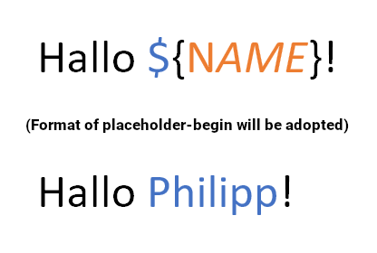

# Docx4JSRUtil - Search and replace util for Docx4J

Docx4JS*earchAnd*R*replace*Util library helps you to search and replace text inside docx-Documents parsed by [Docx4J](https://github.com/plutext/docx4j).

When you write a placeholder inside a .docx-Document, e.g. `${NAME}` there is no guarantee
this string lands "as is" inside the underlying XML. There can be style markup in between.

Therefore `${NAME}` is most probably `$` + `{` + `NAME` + `}`.
This means we can't just do a simple replace on a `Text`-object (a Docx4J-Type).

Docx4JSRUtil solves this problem.

**PS:** This is not yet in maven central. (TODO)

##### Usage:
           
    WordprocessingMLPackage template = WordprocessingMLPackage.load(new FileInputStream(new File("document.docx")));;
    
    // that's it; you can now save `template`, export it as PDF or whatever you want to do
    Docx4JSRUtil.searchAndReplace(template, Map.of(
            "${NAME}", "Philipp",
            "${SURNAME}", "Schuster",
            "${PLACE_OF_BIRTH}", "GERMANY"
    ));

##### How it works internally
1. It retrieves the list of all `Text`-objects (in correct order) from Docx4J
2. creates a "complete string" (`Text`-list reduced to a single string via concatenation)
3. build lookup information to get from index in complete string to corresponding text object
4. do search for placeholders in "complete string"
5. build a `List<ReplaceCommand>` that is ordered from the last index in the "complete string" 
   to the first (that's important to not invalidate indices of other `ReplaceCommand`s during replacement!)
6. figure out on which `Text`-objects changes has to be done and do the actual replacement   

Place holders can be any string pattern, it doesn't have to be `${}`.
